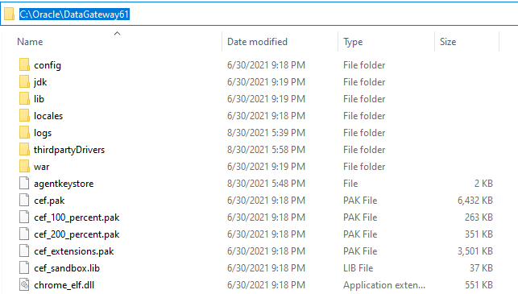
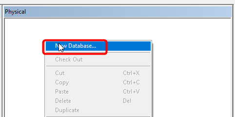
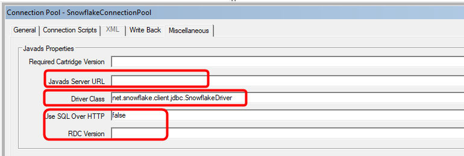
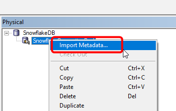
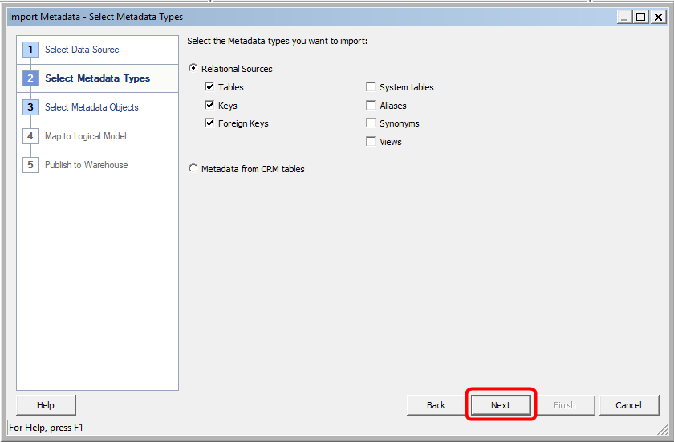
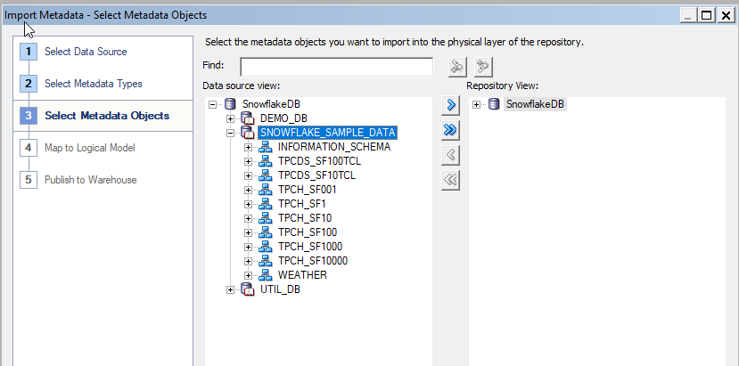

## **Introduction**

Install and Configure a Local Data Gateway to connect and model Snowflake in an RPD using the BI Client Modeler (admintool.exe)

## **Documentation Links**

**Supported Data Sources:** <https://docs.oracle.com/en/cloud/paas/analytics-cloud/acsds/supported-data-sources.html>

**Snowflake Data Model:** <https://docs.oracle.com/en/cloud/paas/analytics-cloud/acsds/create-data-model-connections-snowflake-data-warehouse.html#GUID-3C8367BE-8CCF-4ECF-BD71-103C37F5C59A>

**Local Connection to Snowflake:** <https://docs.oracle.com/en/cloud/paas/analytics-cloud/acsds/create-data-model-connections-snowflake-data-warehouse.html#GUID-C907A44B-76E5-4D1E-B7E1-A1ABF1C2D58E>

**Configure and Register Data Gateway for Reporting:** <https://docs.oracle.com/en/cloud/paas/analytics-cloud/acsds/configure-and-register-data-gateway-reporting.html#GUID-50AC9767-2B31-46FA-835F-52A287560D17>

## **Step 1: Install Local Data Gateway**

**Docs Link:** <https://docs.oracle.com/en/cloud/paas/analytics-cloud/acsds/you-start-data-gateway.html#GUID-47C8EFE0-A652-49AA-BBB3-89080B622D47>

1.  Download Data Gateway

    a.  <http://www.oracle.com/pls/topic/lookup?ctx=cloud&id=oac_data_sync>

    

2.  Unzip/Install Binaries to **C:\\Oracle\\DataGateway61**

    

## **Step 2: Install Snowflake JAR**

1.  Download JAR file from <https://repo1.maven.org/maven2/net/snowflake/snowflake-jdbc/>

    a.  <https://repo1.maven.org/maven2/net/snowflake/snowflake-jdbc/3.9.2/snowflake-jdbc-3.9.2.jar>

2.  Install JAR file into Data Gateway install

    a.  Create directory C:\\Oracle\\DataGateway61\\**thirdpartyDrivers**

    b.  Copy **snowflake-jdbc-3.9.2.jar** into ...\\**thirdpartyDrivers\\**

    

## **Step 3: Start and Configure Local Data Gateway**

**Doc Link:** <https://docs.oracle.com/en/cloud/paas/analytics-cloud/acsds/configure-and-register-data-gateway-visualization.html#GUID-66508027-EE50-44F9-B0DE-A535923F0560>

1.  Start Local Data Gateway

    a.  Double-click on **C:\\Oracle\\DataGateway61\\datagateway.exe**

2.  Enter OAC URL

3.  Click **Generate/Re-Generate Key**

4.  **Copy to Clipboard** the Key

    

5.  Log into OAC, access the **Console** and then **Remote Data Connectivity**

    a.  Click **Add**

    b.  Paste Key into **Public Key**

    c.  Click **OK**

    

6.  Enable and Test Local Data Gateway

    a.  Switch back to the Local Data Gateway

    b.  Click **Enable**, **Test** and **Save**

    

7.  Obtain Local Data Gateway Port from (the port may change over time) **C:\\Users\\{win_username}\\AppData\\Local\\Temp\\DataGateway\\ports.properties**

    

 ## **Step 4: BI Client Modeler Setup**

**Doc Link:** <https://docs.oracle.com/en/cloud/paas/analytics-cloud/acsds/configure-and-register-data-gateway-reporting.html#GUID-50AC9767-2B31-46FA-835F-52A287560D17>

1.  Open Admin Tool and **Load Java Datasources**

    a.  Click **File**, **Load Java Datasources**

    

    b.  Enter **localhost** and port from **port.properties,** enter **dummy** for user

    

    c.  Click **OK**

    > 

## **Step 5: Connect and Model Snowflake**

**Doc Link:** <https://docs.oracle.com/en/cloud/paas/analytics-cloud/acsds/create-data-model-connections-snowflake-data-warehouse.html#GUID-C907A44B-76E5-4D1E-B7E1-A1ABF1C2D58E>

1.  Create a **New Database**

    

2.  Enter **Name** and select **Database type**

    

3.  Select the **Connection Pools** and click the **Add**

    a.  Enter **Name**

    b.  Select **JDBC (Direct Driver)**

    c.  Enable **Require fully Qualified table names**

    d.  Enter **Connect String**

        i.  jdbc:snowflake://xxxx.snowflakecomputing.com?db=ODEV&warehouse=xxxxxx&schema=xxxxxx

    e.  Enter **User name**

    f.  Enter **Password**

    

    g.  Select the **Miscellaneous** Tab

    h.  Clear **Javads Server URL**

    i.  Enter **net.snowflake.client.jdbc.SnowflakeDriver** for Driver Class

    j.  **JSE SQL Overe HTTP** set to **False**

    k.  Clear **RDC Version**

    l.  Click **OK**, then **OK**

    

    

4.  Import Metadata

    a.  Right-click, select **Import Metadata**

    

    b.  Click **Next**

    

    c.  Select desired tables

    

    

## **Step 5: Upload Model in OAC and Test in DV**

